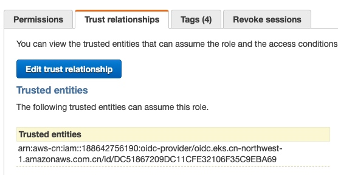

# 步骤3 使用ALB Ingress controller

3.1 创建ALB Ingress Controller所需要的IAM policy , EKS OIDC provider, service account

> 3.1.1 创建EKS OIDC Provider (这个操作只需要做一次）

```bash
eksctl utils associate-iam-oidc-provider \
             --cluster=eksworkshop \ 
             --approve \
             --region cn-northwest-1
```

> 3.1.2 创建所需要的IAM policy
[https://raw.githubusercontent.com/kubernetes-sigs/aws-alb-ingress-controller/v1.1.5/docs/examples/iam-policy.json](https://raw.githubusercontent.com/kubernetes-sigs/aws-alb-ingress-controller/v1.1.5/docs/examples/iam-policy.json)
 * 请注意官方的policy里面包含了WAF等服务，中国区没有所以需要手动删除


```bash
aws iam create-policy \
    --policy-name ALBIngressControllerIAMPolicy \
    --policy-document file://./iam-policy.json \
    --region cn-northwest-1
        
#返回示例,请记录返回的Plociy ARN
{
    "Policy": {
        "PolicyName": "ALBIngressControllerIAMPolicy",
        "PolicyId": "ANPASX274AZPIN2MOYJLS",
        "Arn": "arn:aws-cn:iam::188642756190:policy/ALBIngressControllerIAMPolicy",
        "Path": "/",
        "DefaultVersionId": "v1",
        "AttachmentCount": 0,
        "PermissionsBoundaryUsageCount": 0,
        "IsAttachable": true,
        "CreateDate": "2020-03-04T06:47:15Z",
        "UpdateDate": "2020-03-04T06:47:15Z"
    }
}
```

>3.1.3 请使用上述返回的policy ARN创建service account

```bash
eksctl create iamserviceaccount \
       --cluster=<集群名字> \
       --namespace=kube-system \
       --name=alb-ingress-controller \
       --attach-policy-arn=<policy ARN> \
       --override-existing-serviceaccounts \
       --region cn-northwest-1 \
       --approve

```

> 3.1.4 eksctl 0.15-rc 已知issue, https://github.com/weaveworks/eksctl/issues/1871, 需要手动修复.

在IAM找到eksctl创建的role , 关键词iamserviceaccount

选择Trust relationship, 点击Edit trust relationship

将"Federated":"arn:aws:iam::"
修改为: "Federated": "arn:aws-cn:iam::"


 
3.2 部署 ALB Ingress Controller
 
 >3.2.1 创建 ALB Ingress Controller 所需要的RBAC
 
 ```bash
  curl -LO https://raw.githubusercontent.com/kubernetes-sigs/aws-alb-ingress-controller/v1.1.5/docs/examples/rbac-role.yaml
  
 kubectl apply -f rbac-role.yaml
 
 ```

>3.2.2 创建 ALB Ingress Controller 配置文件
 修改alb-ingress-controller.yaml 以下配置
  - --cluster-name=<步骤2 创建的集群名字>
  - --aws-vpc-id=<eksctl 创建的vpc-id> #eksctl-<集群名字>-cluster/VPC
  - --aws-region=cn-northwest-1
  
 ```bash
  curl -LO https://raw.githubusercontent.com/kubernetes-sigs/aws-alb-ingress-controller/v1.1.5/docs/examples/alb-ingress-controller.yaml
  
  #修改alb-ingress-controller.yaml
  
  #部署ALB Ingress Controller
 kubectl apply -f alb-ingress-controller.yaml
 
 #确认ALB Ingress Controller是否工作
 kubectl logs -n kube-system $(kubectl get po -n kube-system | egrep -o alb-ingress[a-zA-Z0-9-]+)

 ```


    

    
 3.3 使用ALB Ingress   
>3.3.1 为nginx service创建ingress
所以我们重新创建一个使用clusterip的service 

```bash
---
apiVersion: v1
kind: Service
metadata:
  name: "service-nginx-clusterip"
  annotations:
        service.beta.kubernetes.io/aws-load-balancer-type: nlb
spec:
  selector:
    app: nginx
  type: ClusterIP
  ports:
  - protocol: TCP
    port: 80
    targetPort: 80
---
apiVersion: extensions/v1beta1
kind: Ingress
metadata:
  name: "alb-ingress"
  namespace: "default"
  annotations:
    kubernetes.io/ingress.class: alb
    alb.ingress.kubernetes.io/scheme: internet-facing
    alb.ingress.kubernetes.io/target-type: ip
  labels:
    app: nginx
spec:
  rules:
    - http:
        paths:
          - path: /*
            backend:
              serviceName: "service-nginx-clusterip"
              servicePort: 80
```

>3.3.2 验证

```bash
kubectl get ingress
NAME          HOSTS   ADDRESS                                                                          PORTS   AGE
alb-ingress   *       c5e13198-default-albingres-d740-1661034229.cn-northwest-1.elb.amazonaws.com.cn   80      36m

curl -v c5e13198-default-albingres-d740-1661034229.cn-northwest-1.elb.amazonaws.com.cn
```

