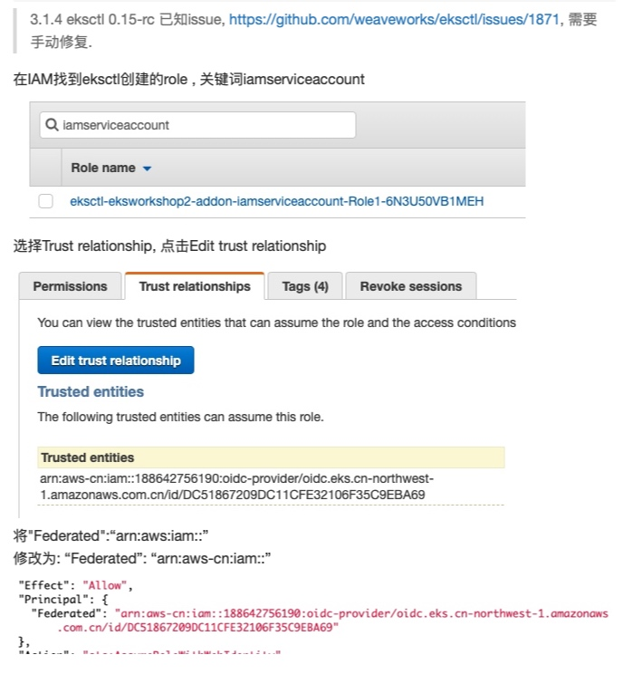

# 步骤5 在EKS中使用IAM Role进行权限管理(可选)
我们将要为ServiceAccount配置一个S3的访问角色，并且部署一个job应用到EKS集群，完成S3的写入。

5.1 配置IAM Role、ServiceAccount

>5.1.1 使用eksctl 创建service account 

```bash
#在步骤3我们已经创建了OIDC身份提供商 

#创建serviceaccount s3-echoer with IAM role
eksctl create iamserviceaccount --name s3-echoer --cluster eksworkshop --attach-policy-arn arn:aws:iam::aws:policy/AmazonS3FullAccess --approve

```

>5.1.2 修复eksctl 创建的Role
参考3.1.4修复



5.2 部署测试应用
*请确保bucket名字唯一,s3 bucket才能创建成功

```bash
#我们准备了一个s3test.yaml
kubectl apply -f s3test.yaml

kubectl exec s3-echoer -- aws s3 ls

#删除
kubectl delete -f s3test.yaml
```
